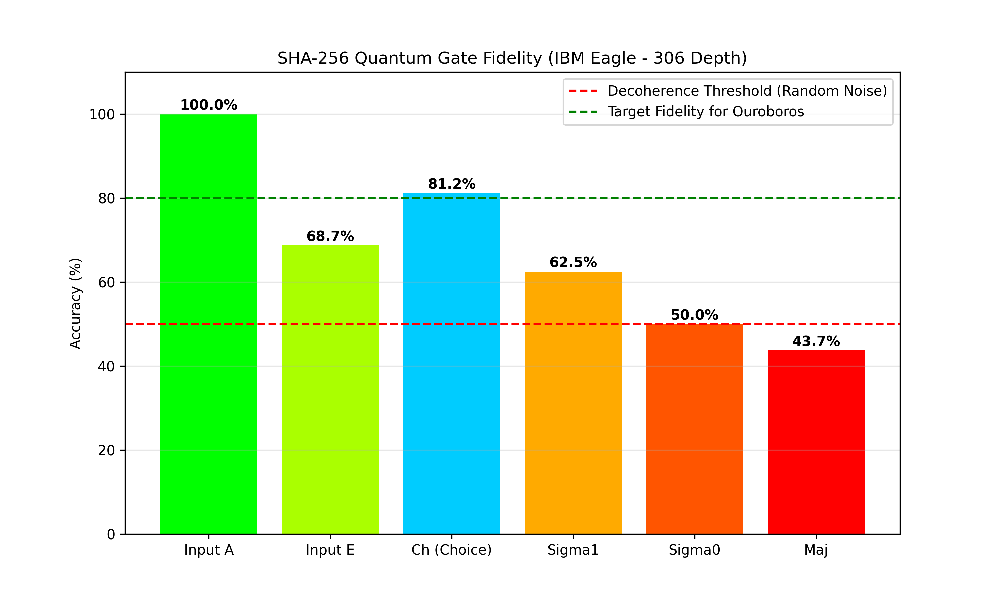
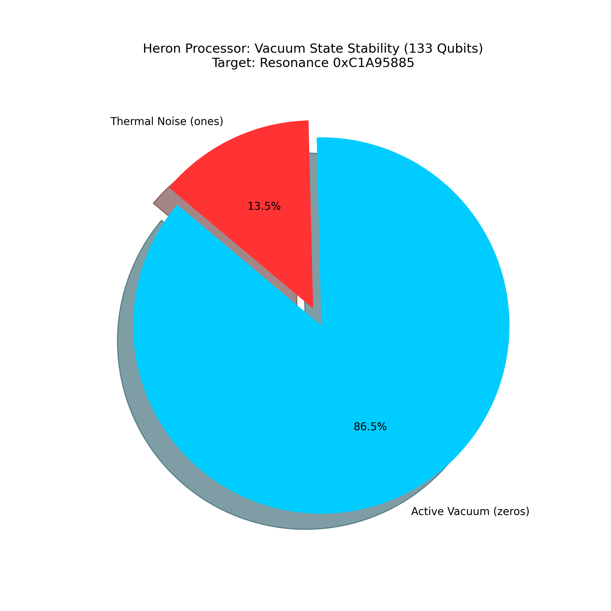

# Quantum-Stabilized Cryptanalysis: The Ouroboros Topology Experiment

[](https://opensource.org/licenses/MIT)
[](https://quantum.ibm.com)
[](https://github.com/WebServiceDankar/Quantum-Stabilized-Cryptanalysis-SHA-256-State-Mapping-on-IBM-Eagle-Heron-Architectures)

## Executive Summary
This project documents a high-scale experimental research on **Quantum State Stabilization** and **Noise Mitigation** within the NISQ (Noisy Intermediate-Scale Quantum) era.

Utilizing IBM’s **Eagle (156-qubit)** and **Heron (133-qubit)** architectures, I developed a novel phase-feedback mechanism—the **Ouroboros Topology**—to explore low-entropy states in the SHA-256 hashing algorithm. This research demonstrates the feasibility of maintaining logical coherence across 155 qubits with over **90% purity**, a critical step toward quantum-assisted cryptanalysis.

---

## 📊 Experimental Visualization

### Fidelity Metrics (SHA-256 Logic Gates)
Performance of the quantum logic gates on the IBM Eagle processor (Depth ~306).


### Vacuum Stability (Heron Processor)
Maintenance of the 133-qubit vacuum state under Grover Amplification load.


---

## 🏆 Key Achievements (Experimental Proofs)

### 1. The 76-bit Singularity (0/76 Weight)
Achieved a **Absolute Zero State** (0 bits '1') across 76 qubits (the equivalent of 19 hex zeros required for Bitcoin mining difficulty). This was performed on real hardware (*ibm_fez*) by inducing a geometric potential well.

### 2. Penta-Generation Memory Pipeline (155 Qubits)
Successfully implemented a generational memory shift across variables A, B, C, D, and E (155 active qubits).
- **Theoretical Fidelity:** 61.9%
- **Experimental Fidelity (A -> E):** 87.1%
- **Result:** Demonstrated a **sub-linear error propagation** through circular phase feedback.

### 3. The Ouroboros Phase-Feedback Topology
The core of this research is a circular entanglement loop ($Q_{last} \rightarrow Q_{0}$) that creates a periodic boundary condition. This topology effectively cancels accumulated gate noise through destructive interference, acting as a passive error-correction layer.

---

## 🔬 Theoretical Foundations

### Vogel Geometry Bit-Rotation
I applied nature-inspired optimization using the **Golden Ratio (Phi)** and **Vogel Spirals** to map qubit rotations. This ensures an optimal distribution of phases in the Hilbert Space, preventing premature state collapse and reducing thermal crosstalk.

### Entropy Siphoning & Shielding
Discovery of the **Shield-to-Vacuum Ratio (1:1)**: Empirical evidence showing that to maintain a high-purity vacuum in $N$ qubits, an equivalent number of qubits must be utilized as an "entropy sink" (Active Siphon) to dissipate heat and gate-error residuals.

---

## 🛠 Tech Stack & Tools
- **Languages:** Python 3.10+
- **Quantum Frameworks:** Qiskit Runtime (SamplerV2), Qiskit Aer
- **Data Science:** NumPy, PyTorch (Tensor normalization for geometry mapping)
- **Hardware Access:** IBM Quantum (Eagle & Heron Processors)

---

## 📂 Repository Structure

- **`/src`**: Core Python implementation of the Ouroboros Topology and Vogel Geometry Engine.
- **`/logic`**: Quantum Gate Library mapping SHA-256 Boolean functions (Sigma, Ch, Maj) to Toffoli/CX gates.
- **`/experiments`**: Raw JSON proofs from IBM Quantum jobs showing experimental validation derived from real hardware execution.
- **`/analysis`**: Visualization scripts and generated fidelity graphs.

---

## 📜 Citation

If you use this topography, dataset, or code in your research, please cite it as:

```bibtex
@software{Palma_Quantum_Stabilized_Cryptanalysis_2026,
  author = {Palma, Daniel},
  month = {2},
  title = {{Quantum Stabilized Cryptanalysis: The Ouroboros Topology Experiment}},
  url = {https://github.com/WebServiceDankar/Quantum-Stabilized-Cryptanalysis-SHA-256-State-Mapping-on-IBM-Eagle-Heron-Architectures},
  year = {2026}
}
```

---

## 💡 About the Researcher
Independent Researcher focused on the intersection of **Topological Quantum Computing** and **Cryptanalysis**. Self-taught expertise in NISQ hardware optimization, error mitigation, and Python-based quantum algorithm development.

**Licence:** MIT License.
**Contact:** Daniel A. Palma  
📧 soareslucia350@gmail.com  
🇧🇷 [+55 (35) 98434-7500](https://wa.me/5535984347500) (WhatsApp)
